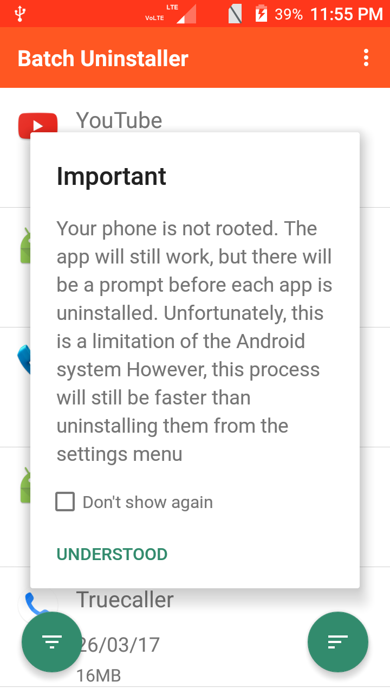
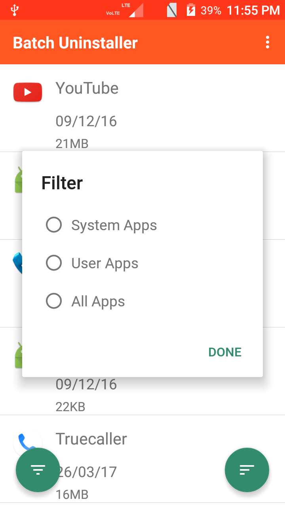
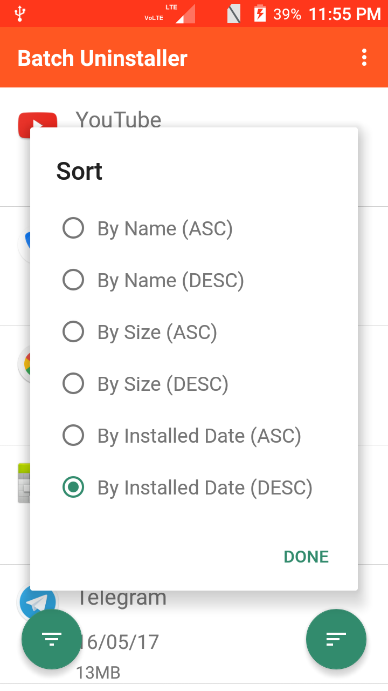
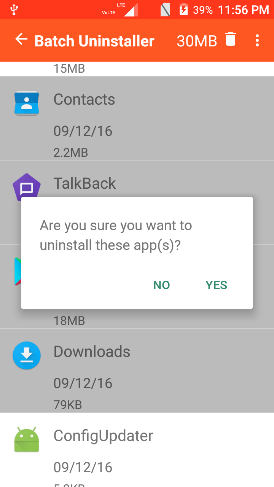

# Batch Uninstaller
An Android app that allows uninstallation of multiple app at once (only if root permission is available, otherwise need to confirm each time).

<!--
-->

## Description

Batch Uninstaller allows you to uninstall multiple apps at once. If root permission is not available, you can still delete multiple apps a lot quicker than you can using the native android implementation.
 
However, you will be prompted for each app uninstalled. Non Root users can not uninstall system apps. This is a limitation with the Android Operating system.

## Features

* Uninstall multiple apps at once
* Sort by date, name and size
* Filter by user and system apps
* Know how much space you are freeing up during the selection process.
* Displays application name, install date and size

## Todo

* Backup system apps before uninstalling for rooted phones.

## Feature Requests

All planned enhancements are here: https://github.com/sarbajitsaha/Batch-Uninstaller/labels/enhancement

If you can't see a similar request, [request yours](https://github.com/sarbajitsaha/Batch-Uninstaller/issues/new) today!

## Donations

Bitcoin donations are welcome and accepted at the following address:
`3GRYNKRUFsefuvKuTycgbMjB4DFxUXVys4`

## Screenshots

## License

Batch Uninstaller is licensed under the GPL, version 3. A copy of the license is
included in [LICENSE.txt](LICENSE.txt).
